```python
#!/usr/bin/env python
# -*- coding: utf-8 -*-
"""CDMA_Basics.ipynb ; Automatically generated by Colaboratory.
Author : Jay Patel, Dalhousie University
"""

#Basic imports
import numpy as np
from matplotlib import pyplot as plt
from scipy.signal import max_len_seq
```

## PROPERTIES OF PN SEQUENCE


```python
font = {'family' : 'Times New Roman',
        'weight' : 'bold',
        'size'   : 17}

plt.rc('font', **font)

plt.figure(figsize=(15,4))
t1 = np.linspace(0, 1, 1500, endpoint=False)
pn = max_len_seq(4,state = [1,0,0,0])[0]
code3 = np.ones(1500)
j = 0
for i in range(1500):
    if i%100==0 and i!=0:
        j+=1
    code3[i] = code3[i]*pn[j]*2-1
plt.plot(t1,code3,'b',lw=3)
plt.ylim(-2, 2)
plt.grid()
plt.xlabel('Time')
plt.ylabel('Amplitude')
plt.title('PN SEQUENCE')
```


    Text(0.5, 1.0, 'PN SEQUENCE')


    
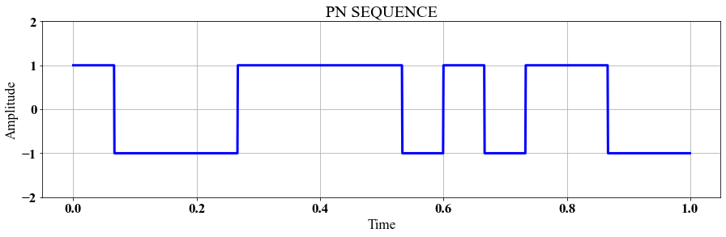
    


```python
pn
```


    array([1, 0, 0, 0, 1, 1, 1, 1, 0, 1, 0, 1, 1, 0, 0], dtype=int8)


```python
pn_npz = pn*2-1 # (0 - 1, 1- (-1))
pn_npz
```


    array([ 1, -1, -1, -1,  1,  1,  1,  1, -1,  1, -1,  1,  1, -1, -1],
          dtype=int8)


# BALANCE PROPERTY


```python
ones = 0
zeros = 0
for seq in pn:
    if seq:
        ones+=1
    else:
        zeros+=1

print(f'Number of Ones: {ones}')
print(f'Number of Zeros: {zeros}')
```

    Number of Ones: 8
    Number of Zeros: 7
    

# RUN PROPERTY


```python
runs = 1
for i in range(len(pn)-1):
    if(pn[i+1]!=pn[i]):
        runs+=1
print(f'Number of Runs: {runs}')
```

    Number of Runs: 8
    

## Auto Correlation


```python
def auto_correlation(c):
    r = []
    for d in range(len(c)):
        sums = 0
        for i in range(len(c)):
            sums+=(c[i]*c[i-d])
        r.append(sums/(len(c)))
    return r

R1 = auto_correlation(pn_npz)
R = []
R[:15] = R1[::-1]
R[15:30] = R1[1:15]
plt.figure(figsize=(15,4))
delay = np.linspace(-14, 15,29, endpoint=False)
plt.plot(delay,R,'b',lw=3)
plt.grid()
plt.xlabel('Delay')
plt.ylabel('R(d)')
plt.title('Auto_Correlation')
```


    Text(0.5, 1.0, 'Auto_Correlation')


    
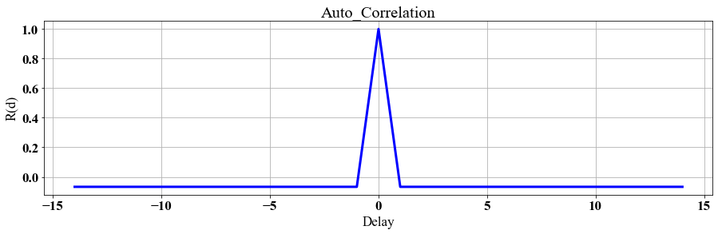
    


## CODE DIVISION

### **Data Input**


```python
def signal_plot(arr,label):
    sig = []
  
    for i in range(len(arr)):
        sig.append(np.ones(50)*arr[i])
    sig = (np.array(sig)).flatten()
    t = np.linspace(0, len(arr), len(sig), endpoint=False)
    plt.figure(figsize=(15,4))
    plt.grid()
    plt.xlabel('Time')
    plt.ylabel('Amplitude')
    plt.plot(sig,'b',lw=3)
    plt.ylim(min(sig)-1,max(sig)+1)
    plt.title(label)

sig1 = [1,0,1,0,1,0,1,0]

sig2 = [0,1,0,1,0,1,0,1]

sig1 = np.array(sig1)*2-1
sig2 = np.array(sig2)*2-1

signal_plot(sig1,label = 'SIGNAL 1')
signal_plot(sig2,label = 'SIGNAL 2')

```


    
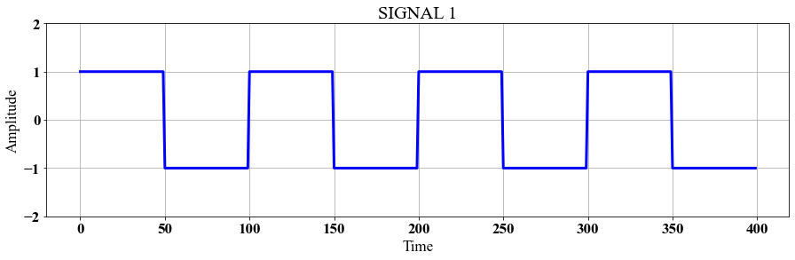
    


    
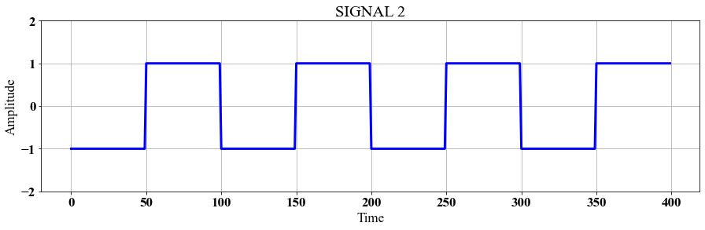
    


### **PN SEQUENCE**


```python
code_1 = max_len_seq(4,state = [1,0,1,1])[0]

code_2 = max_len_seq(4,state = [1,1,0,0])[0]

code_1 = np.array(code_1)*2-1
code_2 = np.array(code_2)*2-1

signal_plot(code_1,label = 'PN SEQUENCE 1')
signal_plot(code_2,label = 'PN SEQUENCE 2')
```


    
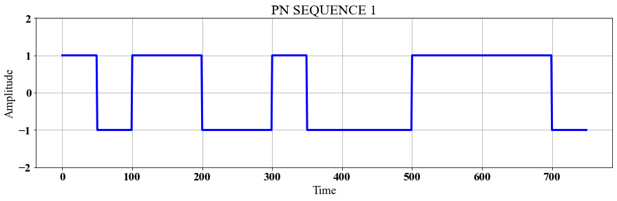
    


    
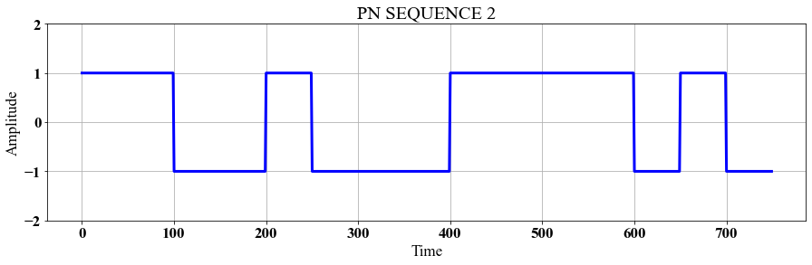
    


### **Code Multiplication**


```python
def code_mul(sig,code):
    mul = []
    for i in range(len(sig)):
        for j in range(len(code[:len(sig1)])):
            mul.append(sig[i]*code[j])
    return np.array(mul)

mul_1 = code_mul(sig1,code_1)
mul_2 = code_mul(sig2,code_2)

signal_plot(mul_1,label = 'MULTIPLIED SIGNAL 1')
signal_plot(mul_2,label = 'MULTIPLIED SIGNAL 2')

```


    
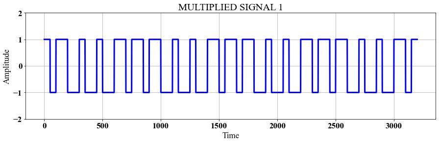
    


    
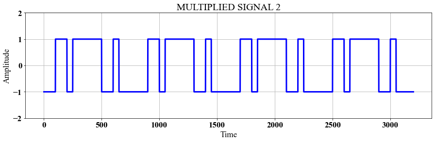
    


### **Combination of signals**


```python
combined = (mul_1+mul_2)

signal_plot(combined,label = "COMBINED SIGNAL")
```


    
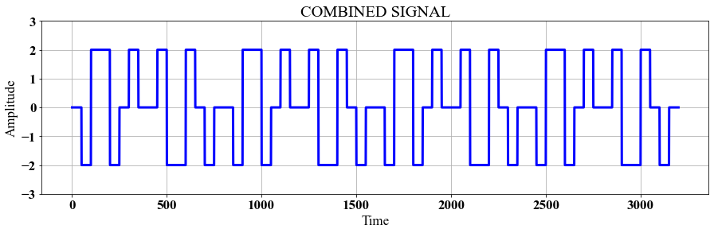
    


# **Receiver End**

## *CODE - 1*


```python
rx1 = []

for i in range(len(sig1)):
    temp = sum(combined[i*len(sig1):(i*len(sig1)+len(sig1))]*code_1[:len(sig1)])
    rx1.append(temp)

signal_plot(rx1,label = 'RECEIVED SIGNAL CORRELATED WITH CODE 1')
signal_plot(sig1,'INPUT_SIGNAL 1')

```


    
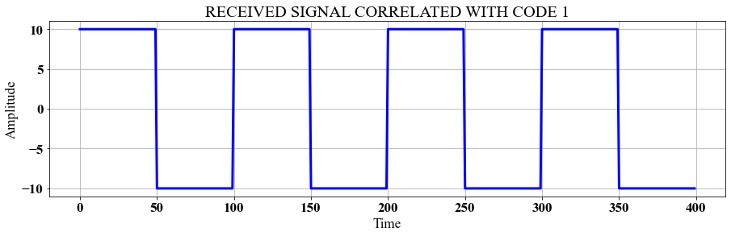
    


    
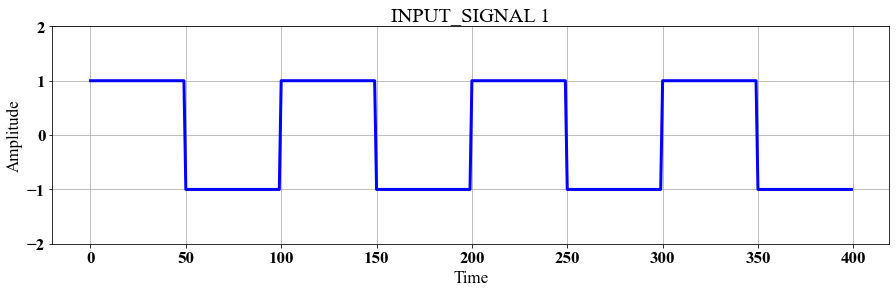
    


## *CODE 2*


```python
rx2 = []

for i in range(len(sig2)):
    temp = sum(combined[i*len(sig1):(i*len(sig1)+len(sig1))]*code_2[:len(sig2)])
    rx2.append(temp)

signal_plot(rx2,'RECEIVED SIGNAL CORRELATED WITH CODE 2')
signal_plot(sig2,'INPUT_SIGNAL 2')
```


    
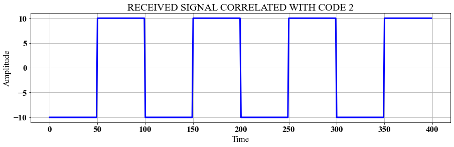
    


    
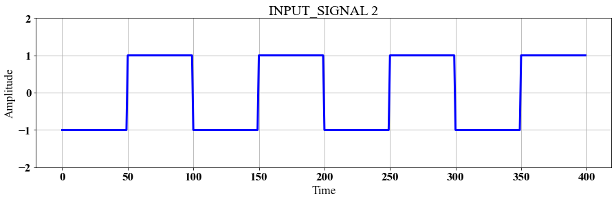
    


## **COMPLETE CDMA FLOW**


```python
signal_plot(sig1,'INPUT_SIGNAL 1')
signal_plot(code_1,'PN SEQUENCE 1')
signal_plot(mul_1,'MULTIPLIED SIGNAL 1')

signal_plot(sig2,'INPUT_SIGNAL 2')
signal_plot(code_2,'PN SEQUENCE 2')
signal_plot(mul_2,'MULTIPLIED SIGNAL 2')

signal_plot(combined,'COMBINED SIGNAL')


signal_plot(rx1,'RECEIVED_SIGNAL 1')
signal_plot(sig1,'INPUT_SIGNAL 1')

signal_plot(rx2,'RECEIVED_SIGNAL 2')
signal_plot(sig2,'INPUT_SIGNAL 2')
```


    

    


    

    


    

    


    

    


    

    


    

    


    

    


    
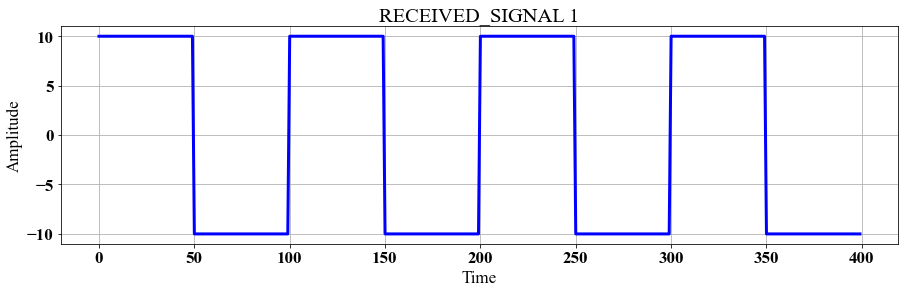
    


    

    


    
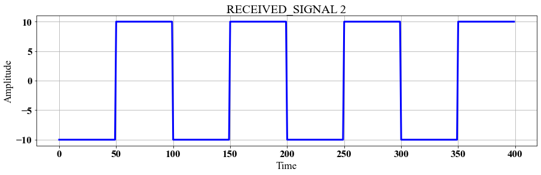
    


    

    

